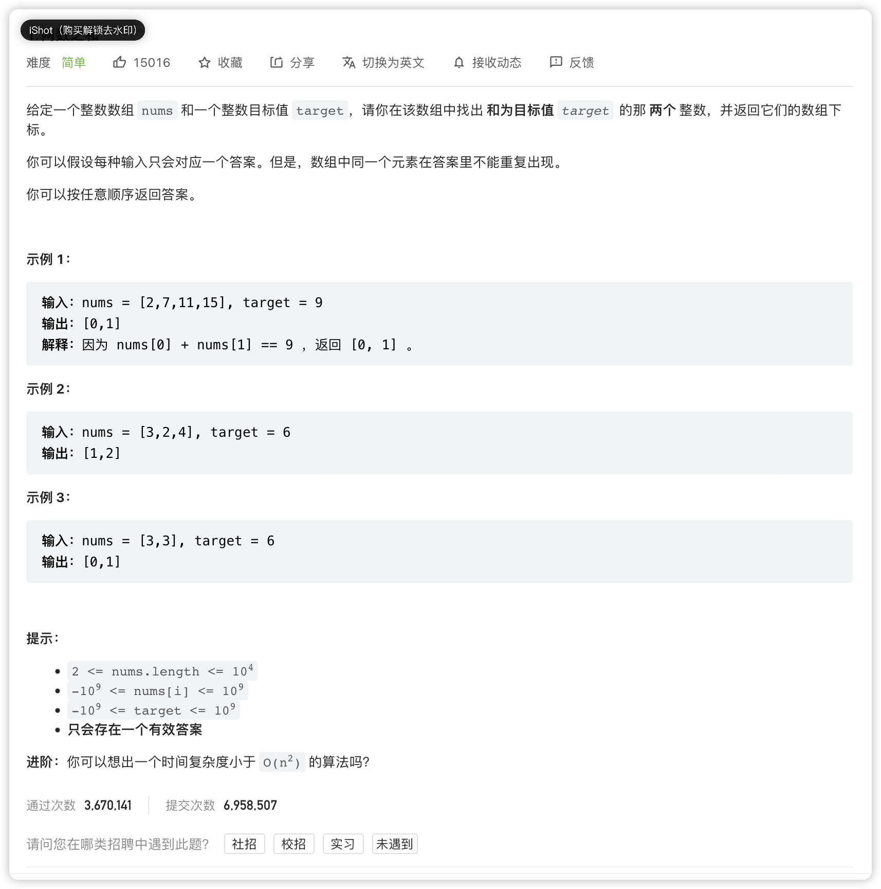

# LC-1. 两数之和

## 题目链接

<https://leetcode.cn/problems/two-sum/>

## 题目描述



## 题解

### 题解一（Java）

> 作者：@仲景

```java
class Solution {
    // 查找结果集法
    public int[] twoSum(int[] nums, int target) {

        int len = nums.length;

        // 创建一个映射集
        Map<Integer, Integer> map = new HashMap<>();

        // 将所有需要的结果都放到映射集中
        for (int i = 0; i < len; i++) {
            // 查找每一个元素对应的结果集是否存在，存在就直接输出
            if (map.containsKey(target - nums[i])) {
                return new int[]{map.get(target-nums[i]), i};
            }
            map.put(nums[i], i);
        }

        // 如果找不到
        return null;
    }
}

```

### 题解二（Go）

> 作者：@仲景

```go
func twoSum(nums []int, target int) []int {
  // 创建一个map，用来存储num和下标
  targetMap := make(map[int]int)

  // 遍历数组
  for index, elem := range nums {
    // 如果目标存在
    if value, exists := targetMap[target-elem]; exists {
      return []int{value, index}
    } else {
      targetMap[elem] = index
    }
  }
  return []int{}
}
```

### 题解三（Kotlin）

> 作者：@仲景

```kotlin
class Solution {
    fun twoSum(nums: IntArray, target: Int): IntArray {

        val map = hashMapOf<Int, Int>()

        // 遍历数组
        for ((index, value) in nums.withIndex()) {
            // 如果答案存在
            val ans = target - value
            if (map.containsKey(ans)) {
                return intArrayOf(map[ans] ?: -1, index)
            }
            map[value] = index
        }

        return intArrayOf()
    }
}
```
