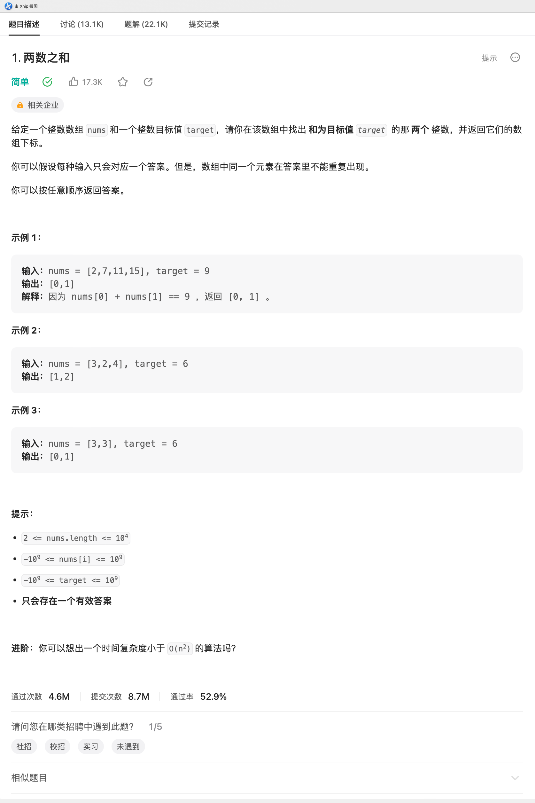

# LC-01.两数之和

## 题目链接

<https://leetcode.cn/problems/two-sum/>

## 题目描述



## 题解

### 题解一（Go）

> @仲景
>
> 使用Map来保存之前出现过的数字，如果目标值-当前数字的结果出现在map中，就找到了答案

```go
package main

// 作者：仲景
// 日期：2023-06-29
func twoSum(nums []int, target int) []int {
    m := make(map[int]int)

    for index, num := range nums {
        success := target - num
        if v, exists := m[success]; exists {
            return []int{v, index}
        } else {
            m[num] = index
        }
    }
    return nil
}

```
