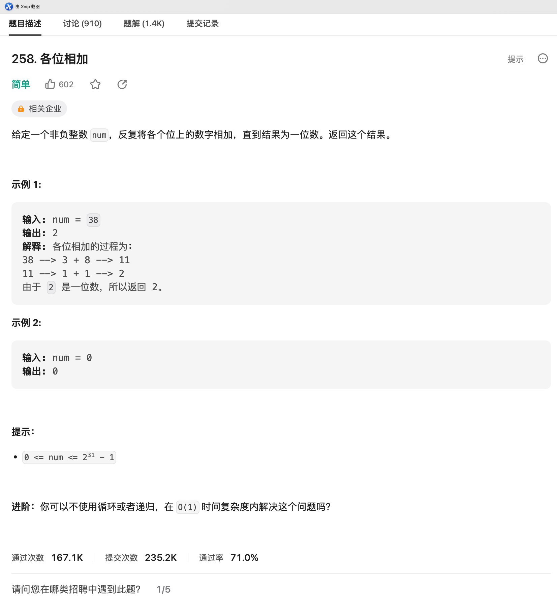

# LC-258.各位相加

## 题目链接

<https://leetcode.cn/problems/add-digits/description/>

## 题目描述



## 题解

### 题解一（Go）

> @仲景
>
> 其实这道题的考察点就是怎么把一个数字各个位置取出来

```go
package LeetCode_258

// 题目：258. 各位相加
// 日期：2023-07-15
// 作者：仲景
func addDigits(num int) int {
  for num > 9 {
    cur := 0
    for num > 0 {
      cur += num % 10
      num /= 10
    }
    num = cur
  }

  return num
}

```
