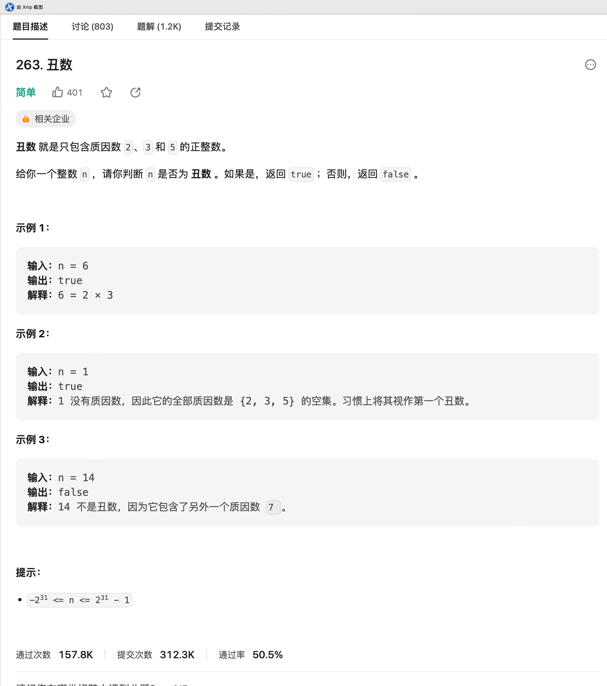

# LC-263.丑数

## 题目链接

<https://leetcode.cn/problems/ugly-number/description/>

## 题目描述



## 题解

### 题解一（Go）

> @仲景

```go
package LeetCode_263

// 题目：263. 丑数
// 日期：2023-07-15
// 作者：仲景
func isUgly(n int) bool {
  if n <= 0 {
    return false
  }

  divs := []int{2, 3, 5}

  for _, div := range divs {
    for n%div == 0 {
      n /= div
    }
  }

  return n == 1
}

```
