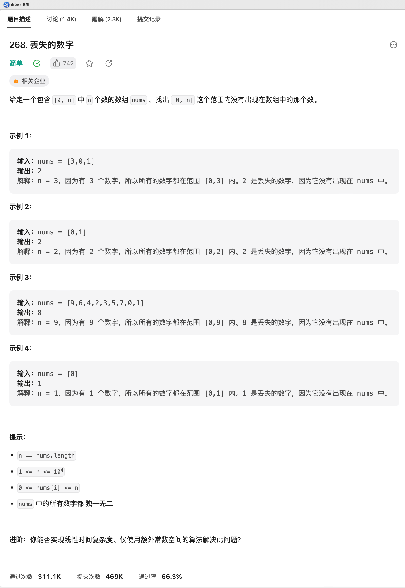

# LC-268.丢失的数字

## 题目链接

<https://leetcode.cn/problems/missing-number/description/>

## 题目描述



## 题解

### 题解一（Go）

> @仲景
>
> 对nums排序，然后依次遍历nums，如果nums和索引不一样，那么索引就是缺的那个数

```go
package LeetCode_268

import "sort"

// 题目：268. 丢失的数字
// 日期：2023-07-15
// 作者：仲景
func missingNumber(nums []int) int {
  n := len(nums)
  // 给nums排序
  sort.Ints(nums)

  for i := 0; i < n; i++ {
    if nums[i] != i {
      return i
    }
  }

  return n
}


```

### 题解二（Go）

> @仲景
>
> 根据异或的特性，可以求出缺少的数
>
> 因为异或满足交换律和结合律，且两个相同的数异或的结果为0，所有把0\~n所有数字都异或一遍，再拿着结果对每个num异或一次
>
> 相同的数异或为0后，就剩下不相同的数，就是结果

```go
package LeetCode_268

// 题目：268. 丢失的数字
// 日期：2023-07-15
// 作者：仲景
func missingNumber02(nums []int) int {
  n := len(nums)
  res := 0
  for i := 0; i <= n; i++ {
    res ^= i
  }
  for _, num := range nums {
    res ^= num
  }

  return res
}

```
